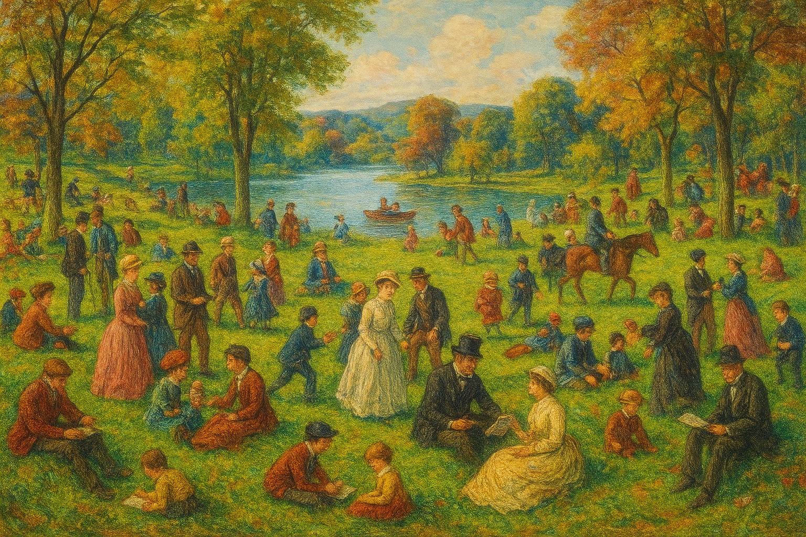
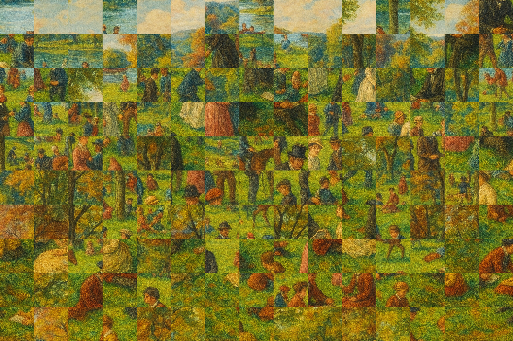

# SAIV — Sorting Algorithms Image Visualizer

Turn images into sortable mosaics and watch classic sorting algorithms rearrange them in real time. SAIV splits an image into blocks, assigns each block a value (hue, saturation, or luminance), and visualizes how different algorithms sort these blocks into a new composition.


## Features
- Visualizes multiple algorithms: merge sort, quick sort, heap sort, bubble sort, selection sort, insertion sort
- Sort by different image-derived metrics: hue, saturation, or luminance
- Frame-by-frame animation using Matplotlib
- Save the final sorted image to `output/`
- Minimal, dependency-light implementation


## Demo

Example input and output are included. After running an example, you'll see an animation window and a final image saved under `output/`.





## Installation

Requirements are listed in `requirements.txt`.

```bash
# Create and activate a virtual environment (recommended)
python -m venv .venv
. .venv/Scripts/activate  # Windows PowerShell: .venv\Scripts\Activate.ps1

# Install dependencies
pip install -r requirements.txt
```


## Quickstart

Run the provided example to see SAIV in action. From the repository root:

```bash
python examples/run_example.py
```

You can adjust these parameters inside `examples/run_example.py`:
- `image_path`: path to your image (default: `images/example.png`)
- `block_size`: block size in pixels (e.g., 50, 100)
- `value_type`: one of `"saturation"`, `"hue"`, or `"luminance"`
- `algorithm_to_use`: one of `"merge"`, `"quick"`, `"heap"`, `"bubble"`, `"selection"`, `"insertion"`

The final image will be written to `output/<algorithm>_sorted_by_<value_type>.png`.


## Usage in Code

Below is a minimal example demonstrating the core pipeline — load, block, visualize, and sort:

```python
from saiv.image_loader import load_image, resize_image, create_blocks
from saiv.sorting import merge_sort
from saiv.visualizer import Visualizer

img = load_image("images/example.png")
img = resize_image(img, block_size=100)

blocks, img_w, img_h = create_blocks(img, block_size=100, value_type="saturation")

viz = Visualizer(blocks, img_w, img_h, block_size=100)
merge_sort(blocks, capture_frame=viz.capture_frame)

viz.animate(interval=50)
viz.save_final_image("output/merge_sorted_by_saturation.png")
```


## API Reference

- `saiv.image_loader`
  - `load_image(image_path) -> PIL.Image`: Loads and RGB-converts the image.
  - `resize_image(img, block_size) -> PIL.Image`: Rounds dimensions down to a multiple of `block_size` and resizes.
  - `create_blocks(img, block_size, value_type)` -> `(blocks, img_width, img_height)`:
    - Splits the image into non-overlapping blocks.
    - Computes an average color per block and derives `value` from `value_type`:
      - `"saturation"`: S channel from HSV
      - `"hue"`: H channel from HSV
      - `"luminance"`: V channel from HSV
    - Each block is a dict: `{ "pos": (x, y), "color": [r,g,b], "value": float, "block": np.ndarray }`

- `saiv.sorting`
  - `merge_sort(arr, capture_frame=None)`
  - `quick_sort(arr, capture_frame=None)`
  - `heap_sort(arr, capture_frame=None)`
  - `bubble_sort(arr, capture_frame=None)`
  - `selection_sort(arr, capture_frame=None)`
  - `insertion_sort(arr, capture_frame=None)`
  - All functions sort the list of block dicts in-place by `block['value']`.
  - If `capture_frame` is provided, it is invoked at key steps to record animation frames.

- `saiv.visualizer`
  - `Visualizer(blocks, img_width, img_height, block_size)`
    - Maintains a canvas and a list of frames.
  - `capture_frame(arr=None)`
    - Draws the current ordering of blocks to the canvas and appends a frame.
  - `animate(interval=50)`
    - Displays an animated playback of the captured frames with Matplotlib.
  - `save_final_image(filename)`
    - Renders the final arrangement and saves it as an image file.


## Project Structure

```
SAIV/
├── examples/
│   └── run_example.py
├── images/
│   └── example.png
├── output/
│   └── merge_sorted_by_saturation.png  # generated
├── saiv/
│   ├── __init__.py
│   ├── image_loader.py
│   ├── sorting.py
│   └── visualizer.py
├── requirements.txt
├── setup.py
└── README.md
```


## Tips and Troubleshooting
- If the animation window does not appear, ensure a GUI backend is available for Matplotlib on your system, or run in an environment that supports windowed output.
- Large `block_size` values reduce processing time but may yield coarser visuals; small values improve detail but increase runtime.
- Ensure your input image dimensions are at least `block_size x block_size` and reasonably divisible by `block_size`.
- For headless environments, you can skip `animate()` and only call `save_final_image()`.


## License
This project is licensed under the MIT License — see the `LICENSE` file for details.


## Acknowledgments
- Built with Pillow, NumPy, and Matplotlib.
- Inspired by visual algorithm demos and image mosaic art.
